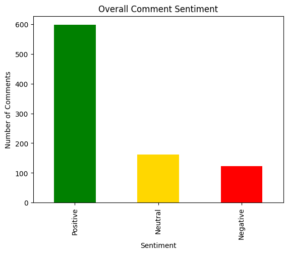
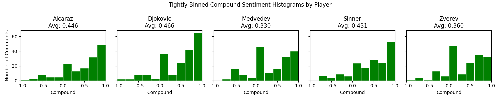
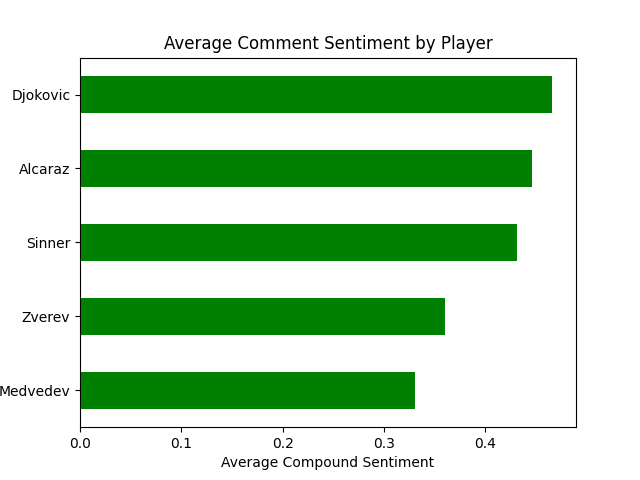

# Final Data Essay: Culture as Data
### Men's ATP Tennis Matches and YouTube Comments

Colin Bertrand

IS 310

May 15th, 2026

## Introduction

My final dataset tells the story of professional men's tennis after the match has already ended. At first, my project was based heavily on performance. Ideas like who won, who lost, what the rankings were, and whether a result counted as an upset. The scope kept developing as I realised the posted scores and statistics weren't going to be seen as culutre, because they were simply the facts getting posted. This is why switching over to YouTube, with more of an emphasis placed on fan base opinions helped me develope a project closer to the class lessons. I combined structured ATP match data with YouTube video information, scraped comments, comment likes, and sentiment scores in order to study how fans respond to tennis matches online.

The final dataset contains 882 YouTube comment rows connected to 39 tennis matches and related highlight videos. The matches focus on five major modern players, including: Jannik Sinner, Carlos Alcaraz, Alexander Zverev, Novak Djokovic, and Daniil Medvedev. Each row includes match-level variables such as tournament, date, surface, round, player rankings, betting odds, score, winner, and whether the result was an upset. It also includes YouTube variables such as the search query, video title, channel, publication date, URL, comment text, comment likes, and sentiment classification. These variables turned a normal sports dataset with match statitics into a cultural dataset about how tennis is narrated and remembered by online audiences.

Rather than treating tennis matches as athletic outcomes, this project treats the fans opinions, reactions commentary, etc, as forms of cultural informatin that can be transformed into data. 

## How I Made the Dataset

The project began with an existing ATP tennis dataset from [Kaggle](https://www.kaggle.com/code/jockeroika/atp-tennis-dataset-2000-2025/input) covering professional matches from 2000 to 2025. This original source gave me a structured foundation including tournaments, players, rankings, scores, odds, surfaces, and match outcomes. From there, I created derived columns that helped connect match data to my larger cultural question. **Rank_Mean** calculated the average rank of the two players in a match, and **Upset** marked whether the lower ranked player defeated the higher ranked player. These variables helped me filter toward high profile matches where fan reaction would likely be more active, and I later used them in the computing logic. 

I then selected matches involving the five players listed above. I created an algorith that would go through each player and select eight matches based on a list of parameters. First, I kept a master set of matches to make sure that a match wasn't duplicated across pplayers. Then I filtered for higher ranking matches, as that would increase the likelihood of a quality video posted from a trusted source was available. The average rank of the players had to be at least 12. Usually the top ten ranked players in the world get most of the media, so the chances of that happening became much greater. I also filtered by descending date, so that matches would be chosen in a timely order. The original tennis dataset goes beyond the dates of YouTube. Even though historical matches may be uploaded, it was easier to choose recent ones. This also helped keep the current narratives for players consistent. A player may have a different fan base or narrative then they did 5-10 years ago. I added a filter between matches, that they had to be at least two weeks apart. I ddn't want 5 of the 8 matches to be from the same tournament/week. This also allowed me to filter tournaments. Since I had a date, and tournaments only happen once a year, I was able to make sure that only one match from each tournament would be selected. This kept the matches more general and broad. Finally, I made sure that there was a range of opponents being played for each player. I didn't want the same two players in all of my matches, so I set a limit for the amount of times each player could go against an opponent. 

After selecting all of the matches, I used the data from each one to generate a YouTube search query. A typical search query combined the player names, tournament, year, and the word "highlights." An example would be *Alcaraz vs Sinner Wimbledon 2025*. all of the matches were looped through, and then a search query was made for them. While in the loop, I used my own YouTube API credentials to do a video search request, using the query. I did a max return of 1 video, so that I could save credits. Then I chose that one video, which usually was a popular and trusted tennis source, as the official highlight video for the match. I saved all of the video information and metadata to the dataset with the chosen matches. There were 40 of them in all, with 8 mathes for the five players. Then, using the YouTube API again, I collected comments from each video using a for loop. I returned a max of 25 comments frmo the video as a json object, and then created a dataframe with all of the comments. This created a second layer of data. The comments and the match/video dataset was merged, creating a final combined dataset. The ATP data describes the athletic event, while the YouTube data describes the media event that formed around it.

My original plan was to collect 8 videos per player and 25 comments per video, which would have produced **40** videos and **1,000** comments. The final dataset came close but did not fully reach that plan. It contains **39** videos and **882** comments. That difference is important because it shows how real data collection often resists the clean scale imagined at the beginning. Some videos had fewer usable comments and some requests returned no data. The API shaped what could be collected, and in the end my parameters might have allowed for a match with little or no media content to slip through. The final dataset records both my research design and the limits of the platform I depended on.

## What the Dataset Represents

The dataset represents a connection between professional sport and social media culture. It does not measure tennis ability in a complete way. Instead, it captures a slice of public reaction to highly visible men's tennis matches. Grand Slam matches make up the largest portion of the dataset, with 400 comment rows. Masters 1000 events account for 302 rows, the Masters Cup accounts for 105 rows, and ATP 500 events account for 75 rows. These events were all ust listed in decsending levels of "importance" or popularity. The surface distribution also reflects wide tennis variety, with 454 rows are connected to hard courts, 278 to clay, and 150 to grass. These don't specifically show a difference in popularity, but more as evidence of variance within the data.

These numbers show that the dataset is shaped by tennis culture. Grand Slams and Masters events are more likely to produce official highlight videos, large audiences, and active comment sections. The dataset therefore represents professional tennis as a media hierarchy. Famous tournaments become easier to find and document because they already have strong media infrastructures around them. This was one of the more important lessons of the project for me. Cultural data often reflects based on visibility before it reflects the real data. The most accessible data is not always the most representative data.

The sentiment labels also reveal something about fan culture. Out of 882 comments, 598 were labeled positive, 161 neutral, and 123 negative, as displayed in the figure below. 

  

The average compound sentiment score was about 0.407, which suggests that the collected comments leaned positive overall. This does not mean tennis fan culture is always positive. It means that the comments gathered from highlight videos about high ranked matches tended to include things like admiration, excitement, respect, and praise. Fans often responded to athletes as personalities and symbols, not only as competitors. 

## What the Dataset Reveals

The clearest finding is that online tennis fandom is not limited to evaluating the final score. Fans very often responded to player style, or contextual cases like rivalry and player character. A match score records the technical outcome, but the comments explain how people made meaning from that outcome. Some of the comments were talking about specific takeaways from that match. *A player was really strong against another player*, etc. Others frame a match as part of a larger rivalry or as evidence that a player is getting way better and will likely be a high rank player in the future.

The dataset also shows how a small group of stars dominates contemporary tennis discussion. Sinner, Alcaraz, Djokovic, Medvedev, and Zverev were not just random athletes in the data. I chose them more specifcally because they are well known figures for search and commentary. Their names made the YouTube searches possible and their matches attracted the comments that shaped the final dataset. This is especially visible with Sinner and Alcaraz. their matches are unofficially interpreted as part of a new rivalry. In these cases, fans aren't just talking about the one match and then done. They're often comparing generations of players, or are predicting future dominance in the sport. I often saw them attach emotional meaning to individual wins and losses. You can see their specific distributions in the figure below:

  

Another figure that reveals insightful results is the players average sentiments:

  

The second figure reveals results that may need context, which a lot of tennis fans probably have. Djokovic, who has the most positive overall sentiment, is part of a tennis group called the "big three", thought of as the historically best players. He has a a lot of popularity from being in the game for so long, and he's the last amongst those players. While controversial occasionaly, he has held fans for a long time and has a lot of resepct, which might be why so many people leave good comments about him. Medvedev, the player with the lowest positive rate, is often very emotionally and unprofessional on court. He has bilt a repoir to be a good player, but he can strive away from the characteristics that the average tennis fan may want to see. This data also reveals another instance of seeing culture as data. The culture and narrative that these players have is a direct explanation as to how fans perceieve them. 

Another pattern is the importance of platform authority. Many rows come from channels such as Tennis TV, Australian Open, Wimbledon, US Open Tennis Championships, Roland-Garros, and other sports media channels. A lot of those channels are the official accuont of the tournament. They help decide which matches become visible to fans. A highlight video on an official tournament channel may attract different audiences and comments than a fan made compilation. The dataset therefore reveals fan sentiment, but it also reveals the media systems that organize fan attention.

## What the Dataset Conceals

The dataset also conceals a great deal. YouTube comments are not the same thing as tennis fandom as a whole. They are comments from users who chose to watch a particular video and leave a public response. This data has no way of knowing who watched the video without commenting, and what those peoples' opinions are. Fans discussing the same match on Reddit, TikTok, Instagram, X, podcasts, group chats, or in person are also missing. My original scope for the project was based on data from X (Twitter), and then I switched to Reddit, and finally to YouTube. While some of that decision was based on API problems and technical obstacles, it was a blessing in disguise because YouTube seemed to have the best fan base opinions. There were both negative and positive comments about all there was to do with tennis. Twitter was too focused on talking about the stats, and reddit was a little more argumentative. People were debating about tennis, but the conversations easily got away from the topic at hand. Still, the dataset only captures one platform and one genre of reaction. It might be more useful in some scenarios to gather data from a multitude of sources, but then you risk different formats and restrictions.

The sentiment analysis has limits as well. I used VADER sentiment scoring to classify comments as positive, neutral, or negative. VADER is useful because I found it was specifically designed for social media text and can process comments at scale. From my own opinions after looking trhough the final dataset, I found it cannot fully understand sarcasm or tennis-specific language, especially when emotionally charged. For example, a comment about a "heartbreaking loss" may receive a negative score even if the larger comment praises a player's resilience. There were also occasional moments when a comment mentioning a "hard battle" was negative. For that reason, sentiment scores should be treated as interpretive signals, not objective truth.

The dataset also conceals identity. I did not collect usernames, locations, demographic information, or personal profiles, which was an intentional ethical choice. However, that also means I cannot analyze who the commenters are or how different fan communities interpret matches. These players all represent different nationalities and backgrounds. While tennis may not be as "loyal" as futbol or other international sports, an audience member from a specific country is still likely to have more positive feelings about a player from the same place. The comments become cultural traces separated from the people who wrote them. That protects privacy, but it limits some ofthe potential geographic analysis.

## Computation, Scale, and Ethics

Computation shaped every stage of the project. Even creating the initial dataset, I utilized python to do basic exploration of the tennis matches avilable. Python and pandas allowed me to filter the ATP dataset, create derived variables, generate YouTube search queries, merge match records with video metadata, and structure the final CSV. The YouTube API made it possible to collect video and comment data at a scale that would have been difficult manually. VADER sentiment analysis then converted unstructured text into numerical and categorical sentiment variables.Because I had to switch the platform I was scraping data from so much, I ended up with three different initial datasets, all having gathered data from the respective social media platform. I realised how long it took to manually gather just that small amount of data. While I was still able to pull valuable insights from that data by gathering it, and maybe a human understanding of sentiment is better than a sentiment analyzer, there is no reasonable way to scale up data without computation. 

This process changed how I understood scale. My initial goal was to just gain as much information as possible using all of the data avilable to me from the tennis dataset. By the end, I understood that scale changes the kind of question a dataset can answer. A few comments can be read closely as individual opinions. Hundreds of comments can reveal broader patterns in tone, visibility, and media circulation. At the same time, scaling up creates distance. Once comments become rows with sentiment labels, some humor, context, and emotional complexity gets flattened. Looking at my initial dataset, I made specific decisions when choosing what matches were analyzed and I skipped comments which I saw as uneccessary towards the overall dataset scope. This allowed me to make human-in-the-loop decisions, which likely helped the overall dataset. I can use that data to make really good decisions on those specific groups. When I scale up the data, I gain way more information but I get way less specific about what I can do. The scaled dataset needed to still include data that had a scope, not just data that was available and meaningless. This is why the filtering of the matches came in so handy, because I was able to make impactful decisions for the scaled dataset in the pre-processig stage, instead of dealing with the consequences later. There were of course more problems when the data was scaled up and the gathering become autonomuous, but the amount of usable data also became way more, so in the end it worked out. 

The ethical issues in the project were also important. Although the comments were publicly available, public does not automatically mean consequence free. People who leave YouTube comments may not imagine their words becoming part of a structured academic dataset, so it felt unfair to collect all of the data that came along with YouTube comments. For that reason, I did not collect identifying user information. I DID chose to collect YouTube Channel name and informaton, thoughh this was because they're making a choice to publish content publicly, and under a public name. It felt less personal, and more liek the entire point of posting on YouTube. Those channels want their content out there, and collecting a channel name is harmless, compared to collecting the names of specific individuals who are leaving a much smaller impact on the video page. I also had to be careful not to treat sentiment labels as final judgments about what fans meant. A model can misread tone, so responsible interpretation requires acknowledging uncertainty. There were instances where tones were misread, but assumptions were made too. I had to state my schema of what was a positive reaction about a match and what was a negative reaction. If I'm looking at the specific player I chose, and they lost, does that mean every positive comment about the other player is seen as negative aginst the player I chose? If a comment talks bad about one player, and good about another, how is that labeled. I chose in the end to count all comments to be non-specific towards the player I chose. So any coment talking positive about a player was seen as positive. That also helped align the goals around seeing culture as data, as I'm analyzing the culture of tennis on sports social medias. Making the data specific towards oe player takes away a whole side of culture.

## Scholarship and Reflection

This project connects to scholarship about data, social platforms, and sports. The comments I collected were shaped by YouTube search, API access, available highlight videos, and my own filtering choices. They were drawn from a specific topic on a specific platform. Because of this, the study can reveal insights into both YouTube and the sport of tennis. Those insights can be seen independently as well. Many of the comments were positive, which could lead me to believe that YouTube overall has a more postive and welcoming fanbase, where if I were to do this study on another platform, I may find a different result. I can also look at the sport of tennis. Tennis may promote more respect and admiration for the players. If I did this study on the NBA or NFL, there may be more negative comments because there are bigger rivalries and fan emotions. Fan bases within those two sports may be arguing more often.

The project also connects to scholarship on sports media and digital fandom. Sports fan watching games are *actively* watching. They  produce meaning through commentary, debate, and emotional expression. My dataset demonstrates this process around tennis highlights. Fans use comment sections to evaluate athletes and connect individual matches to larger stories. There is more of a respective fanbase around the sport of tennis specifcally. The players are more of a symbol instead of a team. A person can like a multitude of tennis players, and just enjoy the sport. 

My biggest intellectual growth over the semester was learning to see data as an argument rather than a mirror. At the beginning, I thought the project would simply show whether fans reacted positively or negatively to certain matches. I assumed that it'd be pretty clear an audience reacted positively to a win, and would only talk about the winning player, and that the data for each match was consistent on that basis. By the end, I understood that the dataset itself had a point of view. It privileges the sport based on certain characteristics. This could be how famous the player is, major tournaments, English language comments, how easily accessible the YouTube/social media platform is, and the types of comments that sentiment tools can classify. I found patterns in the data, but ones that fell mostly within those boundaries. It was a lot less black and white then just whether the player won their match. I also learned a lot about how data is represented, and how powerful it can be to shape the data. When I first started scaling up, my idea was to get as many matches and as many comments. I knew I had to be within 1000 observations, but the data was going to be much less structures. It was more about just looping through the data and scraping all of it. I've been able to see much more how specific characteristics about the ahtletes, about the sport of tennis and how the culture within the sport could help me shape my data and figure out what to gather. 

## Conclusion

This dataset tells the story of tennis as a cultural event that continues after the match ends. It combines ATP match records with YouTube comments to show how fans transform performance into narrative. It reveals fan personalities like admiration and emotional investment, as well as match charceteristics like rivalry or popularity. Social media platforms also play a role in shaping what fans see and discuss. This type of study does conceals quieter audiences, other platforms, and meanings that automated sentiment analysis cannot capture.

The process taught me that computation is not separate from interpretation. The code i made helped me collect and analyze the data, but human judgment shaped the research question, match selection, and overall meaning of the results. Working with culture as data required accepting initial messiness instead of pretending it was a flaw. In the end, my dataset is not a complete picture of tennis fandom. It is a structured glimpse into how high ranking men's tennis becomes conversation and emotion in the digital social media platforms where fans gather after the match.

